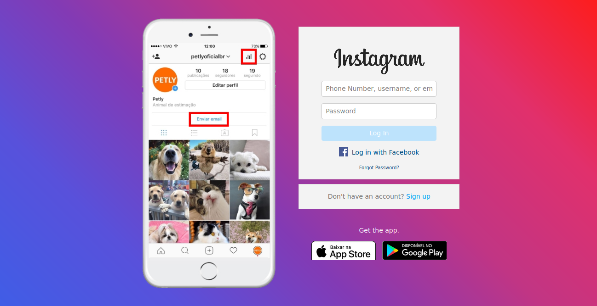

# Clone do Instagram
## Recriando a Página de login do Instagram
---
> Esse Projeto foi desenvolvido com auxilio do curso **Recriando a página inicial do Instagram** pelo **bootcamp da everis** na **digital innovation one**. Foi abordado o conceito sobre CSS Flexbox e responsividade!

Segue abaixo o resultado final da página:

**O que foi imprementado no projeto?**
*Foi refeito a tela por completo adicionando um form para o usuário fazer login no sistema, adicionado um background em gradient com as principais cores do tema instagram.*

Publicação no linkedin com maiores detalhes do projeto!
[Publicação](https://www.linkedin.com/posts/fabricio-pereira-6282251a6_finalizado-meu-primeiro-projeto-do-bootcamp-activity-6732295638060429312-kqio)